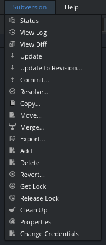

Users/Administrators use private/public repository URLs to import projects into workspaces, to use the Git / Subversion menus, and to use/create a [Factory](../../docs/workspace-automation). Some repository tasks such as git push and access to private repositories require setting up SSH or oAuth authentication mentioned below.
# Using SSH  
Setup of an SSH keypair is done inside each user's workspace. Refer to [Eclipse Che git docs](https://eclipse-che.readme.io/docs/git#ssh-key-management) for additional information. Setting up SSH keypairs inside a workspace must be done prior to being able to use associated private repository URLs.

Refer to specific [GitHub](https://eclipse-che.readme.io/docs/git#section-github-example) and [GitLab](https://eclipse-che.readme.io/docs/git#section-gitlab-example) SSH examples on how to upload public keys to these repository providers.

For other git-based or SVN-based repository providers, please refer to their documentation for adding SSH public keys.
# Using oAuth  
## GITLAB OAUTH
Currently it's not possible for Codenvy to use oAuth integration with GitLab. Although GitLab supports oAuth for clone operations, pushes are not supported. You can track [this GitLab issue](https://gitlab.com/gitlab-org/gitlab-ce/issues/18106) in their issue management system.

##GITHUB OAUTH
### Setup oAuth
Register an application in your GitHub account. Refer to [Setup oAuth at GitHub](https://eclipse-che.readme.io/docs/git#section-setup-oauth-at-github) for additional information.

Update the `/etc/puppet/manifests/nodes/codenvy/codenvy.pp` with secret, id and callback:
```text  
oauth.github.clientid=yourClientID
oauth.github.clientsecret=yourClientSecret
oauth.github.authuri=https://github.com/login/oauth/authorize
oauth.github.tokenuri=https://github.com/login/oauth/access_token
oauth.github.redirecturis=http://$hostname/wsmaster/api/oauth/callback\
```
After the above steps, execute `puppet agent -t`.

### Using oAuth
Users/Administrators can use a private/public repository url to [import a project](https://eclipse-che.readme.io/docs/git#section-using-oauth-in-workspace) into a workspace, use the git menu remote push command in workspace, and to create/use a [factory](../../docs/workspace-automation).

**Note setting up oAuth must be done prior to being able to do commits and pushes.**


# Git and Subversion Workspace Clients
After importing repository, you can perform most common Git and SVN operations using interactive menus or as console commands.

**Note use of git menu remote push command will not work prior setting up SSH or oAuth authentication.**





# In-IDE Pull Request Panel
Within the IDE there is a pull request panel to simplify the creation of pull requests for GitHub, BitBucket or Microsoft VSTS (with git) repositories.

# Customizing How Factories Import Source Code
It's possible to customize the behavior of source code cloning into a [project](../../docs/projects) and what branch is used for a [Factory](../../docs/workspace-automation).
